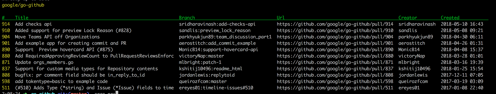
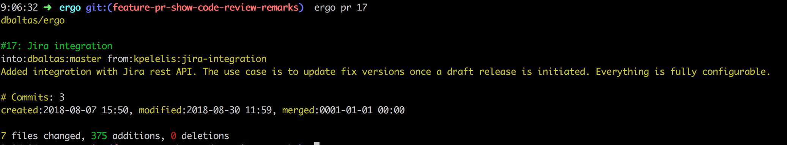
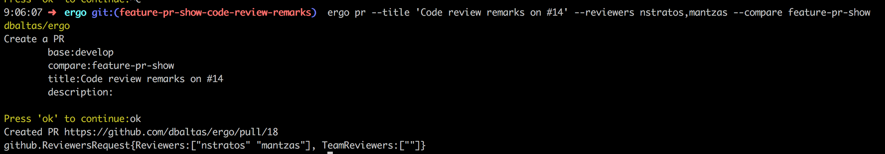

[](https://travis-ci.org/dbaltas/ergo)
# ergo

Ergo (έργο), greek name for work, is a list of utilities for the daily developer workflow

```
# getting the status of repo branches compared to master
ergo status
```


```
# List open github pull requests for google/go-github repo
ergo prs
```


```
# Display details for github pull request #17
ergo pr 17
```


```
# Create a github pull request through command line
# In the screenshot the compare flag overrides the current branch
ergo pr --title 'my title' --reviewers johndoe,nstratos
```


## Installation
```
$ go get github.com/dbaltas/ergo
```

## Usage
```
Usage:
  ergo [flags]
  ergo [command]

Available Commands:
  deploy      Deploy base branch to target branches
  draft       Create a draft release [github]
  help        Help about any command
  pr          Create a pull request [github]
  prs         List open pull requests [github]
  status      Print the status of branches compared to baseBranch
  version     Print the version of ergo

Flags:
      --base string       Base branch for the comparison.
      --branches string   Comma separated list of branches
      --detail            Print commits in detail
  -h, --help              help for ergo
      --path string       Location to store or retrieve from the repo (default ".")
      --repoUrl string    git repo Url. ssh and https supported
      --skipFetch         Skip fetch. When set you may not be up to date with remote
```


## SSH access
For ssh access to repos make sure you have a running ssh-agent 
```
$ eval `ssh-agent`
Agent pid 4586
$ ssh-add 
```

## Github Access
To communicate with github you will need a [personal access token](https://github.com/settings/tokens) added on the configuration file as `access-token` on github

## Config
Configuration is read from $HOME/.ergo.yaml

Sample config file
```yaml
generic:
  remote: origin
  base-branch: "master"
  status-branches: "develop,staging,master,release-es,release-gr"
  release-branches: "release-es,release-gr"
github:
  access-token: "access-token-goes-here"
  release-body-prefix: "### Added"
release:
  branch-map:
    release-gr: ":greece:"
    release-es: ":es:"
    ft-release-gr: ":greece:"
    ft-release-es: ":es:"
    ft-release-it: ":it:"
  on-deploy:
    body-branch-suffix-find: "-No-red.svg"
    body-branch-suffix-replace: "-green.svg"
repos:
  ergo-functional-test-repo:
    status-branches: "master,ft-release-gr,ft-release-es,ft-release-it"
    release-branches: "ft-release-es,ft-release-gr,ft-release-it"
```