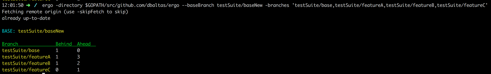

[](https://travis-ci.org/dbaltas/ergo)
# ergo

Ergo (έργο), greek name for work, is a list of utilities for the daily developer workflow



# Actions
Currently one action is available

* Compare multiple branches in means of commits ahead and commits behind a base branch

# Run
```
$ go build -o ergo main.go
$ ./ergo -directory path-to-repo -branches 'qabranch,productionbranch,mybranch,yourbranch'
```

# Usage
```
ergo is a tool that aims to help the daily workflow

Usage:
  ergo [flags]
  ergo [command]

Available Commands:
  deploy      Deploy base branch to target branches
  draft       Create a draft release on github comparing one target branch with the base branch
  help        Help about any command
  status      Print the status of branches compared to baseBranch
  version     Print the version of ergo

Flags:
      --baseBranch string   Base branch for the comparison.
      --branches string     Comma separated list of branches
      --detail              Print commits in detail
      --directory string    Location to store or retrieve from the repo (default ".")
  -h, --help                help for ergo
      --repoUrl string      git repo Url. ssh and https supported
      --skipFetch           Skip fetch. When set you may not be up to date with remote

Use "ergo [command] --help" for more information about a command.
```


# SSH access
For ssh access to repos make sure you have a running ssh-agent 
```
$ eval `ssh-agent`
Agent pid 4586
$ ssh-add 
```