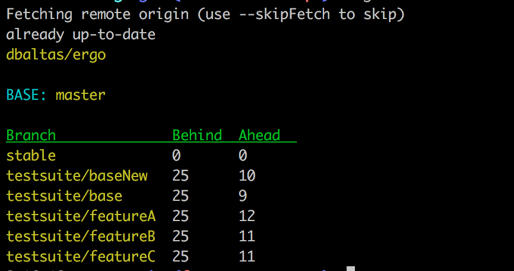

[](https://travis-ci.org/dbaltas/ergo)
# ergo

Ergo (έργο), greek name for work, is a list of utilities for the daily developer workflow

```
# getting the status of repo branches compared to master
ergo status
```


```
# List open github pull requests for google/go-github repo
ergo prs
```


## Installation
```
$ go get github.com/dbaltas/ergo
```

## Usage
```
Usage:
  ergo [flags]
  ergo [command]

Available Commands:
  deploy      Deploy base branch to target branches
  draft       Create a draft release [github]
  help        Help about any command
  pr          Create a pull request [github]
  prs         List open pull requests [github]
  status      Print the status of branches compared to baseBranch
  version     Print the version of ergo

Flags:
      --base string       Base branch for the comparison.
      --branches string   Comma separated list of branches
      --detail            Print commits in detail
  -h, --help              help for ergo
      --path string       Location to store or retrieve from the repo (default ".")
      --repoUrl string    git repo Url. ssh and https supported
      --skipFetch         Skip fetch. When set you may not be up to date with remote
```

## Jira Integration

ergo can also update Jira tasks. More specifically, each time a draft command is run, ergo will try to update the fix version of a task.
For this to work, you need to include the task ID in at least one commit that will be included in the draft release. The actual name of
the fix version is configurable, as well as the regular expression that will try to match the task IDs.

Updating the fix versions can be enabled using the `--update-jira-fix-versions` flag.

Example:

```
$ ergo draft --base staging-develop --update-jira-fix-versions
Changing fixed version for task TEAM-30 to Next Release
Changing fixed version for task TEAM-33 to Next Release
Changing fixed version for task TEAM-36 to Next Release
Changing fixed version for task TEAM-37 to Next Release
Changing fixed version for task TEAM-947 to Next Release
```

In the previous example we have set `jira.draft-version` to 'Next Release' and `jira.task-regex` to `[A-Z0-9]+-[0-9]+`

## SSH access
For ssh access to repos make sure you have a running ssh-agent 
```
$ eval `ssh-agent`
Agent pid 4586
$ ssh-add 
```

## Github Access
To communicate with github you will need a [personal access token](https://github.com/settings/tokens) added on the configuration file as `access-token` on github

## Config
Configuration is read from $HOME/.ergo.yaml

Sample config file
```yaml
generic:
  remote: origin
  base-branch: "master"
  status-branches: "develop,staging,master,release-es,release-gr"
  release-branches: "release-es,release-gr"
github:
  access-token: "access-token-goes-here"
  release-body-prefix: "### Added"
release:
  branch-map:
    release-gr: ":greece:"
    release-es: ":es:"
    ft-release-gr: ":greece:"
    ft-release-es: ":es:"
    ft-release-it: ":it:"
  on-deploy:
    body-branch-suffix-find: "-No-red.svg"
    body-branch-suffix-replace: "-green.svg"
repos:
  ergo-functional-test-repo:
    status-branches: "master,ft-release-gr,ft-release-es,ft-release-it"
    release-branches: "ft-release-es,ft-release-gr,ft-release-it"
jira:
  url: "https://your.jira.url.com"
  username: "username"
  password: "password"
  task-regex: "[A-Z0-9]+-[0-9]+"
  draft-version: "Next Release"
```